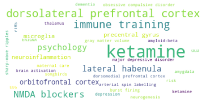
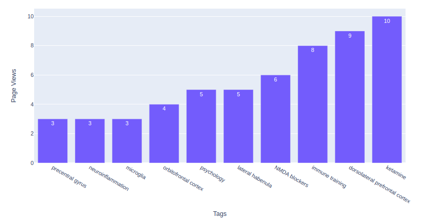
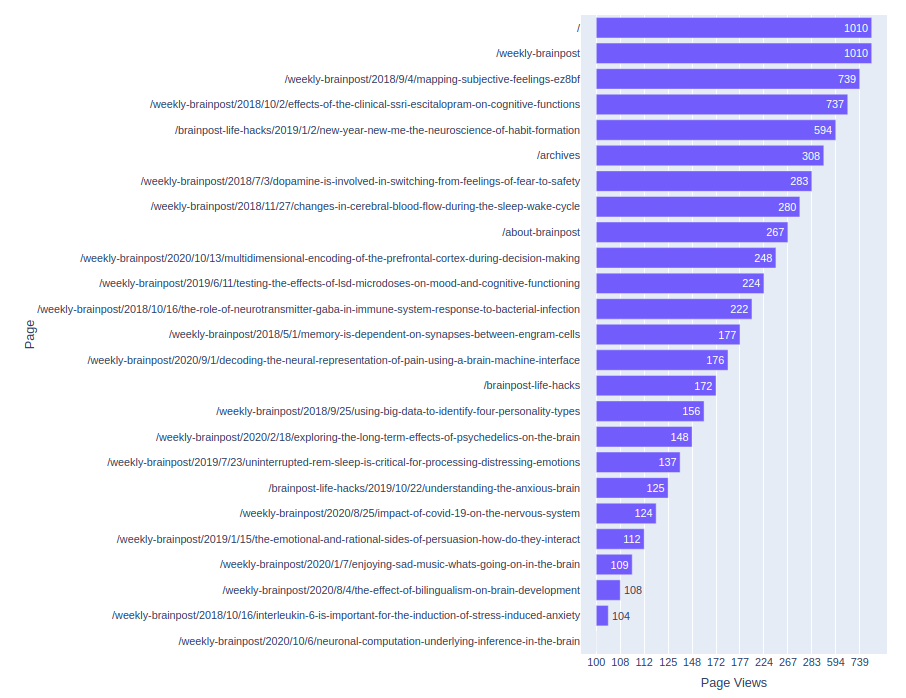
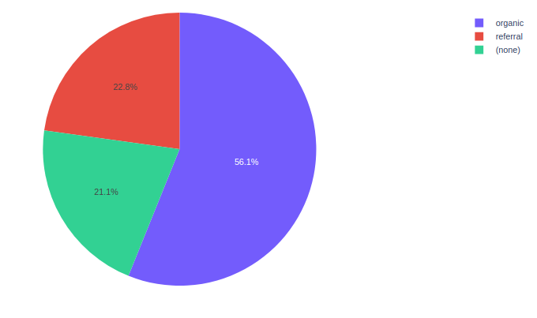
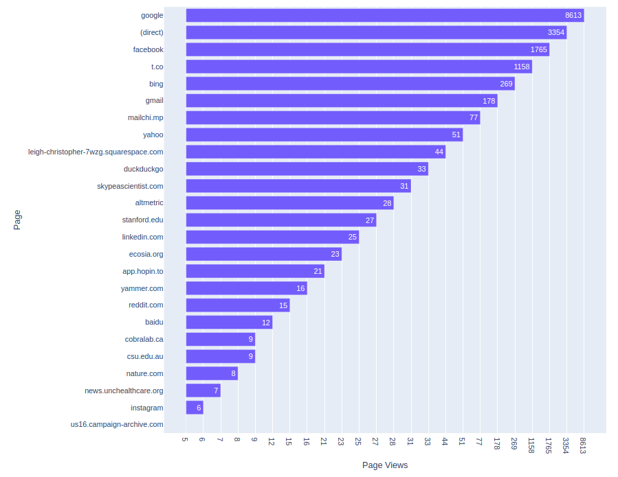
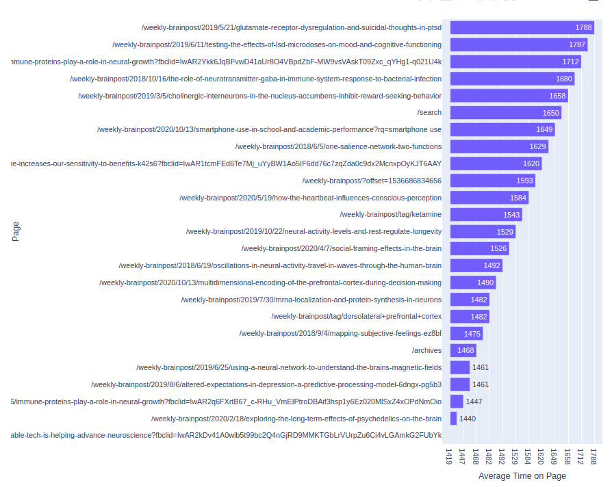
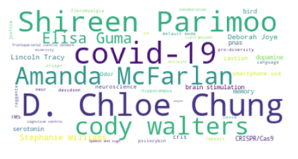

# Report : DSS Brainpost Web Analytics Challenge

- Date Nov 10, 2020


**Description**
- The page view data is from http://BrainPost.co
- The data includes page view information for weekly published pages.
**Questions**
- What content (or types of content) is most popular (what are patterns we see in popular content) and is different content popular amongst different subgroups (e.g. by source/medium)?

- Any question that will help us to take action to better tailor our content to our audience(s) or understand how traffic comes to the site.

- Where are people visiting from (source-wise)?

## Approach
- In order to seek the answers to the question, the task was broken down as follows
	- Understanding Data/Data Information
	- Data Cleansing
	- Data Analysis
	 
### Part 1. Data Information

The data was available as a spreadsheed entered across different sheets. To have an overall picture of the data, the first step required was to bring all the data together. The data from following sheets was aggregated.
- content-pages oct 18-31
- content-pages oct 4-17
- content-pages sept 20-oct3
- content-pages sept 6-19
- content-pages aug23-sept5
- content-pages jul 26 - aug 8
- content-pages july 12-25
- content-pages aug 9-22

The data in sheets contained some header text and two tables.
As each sheet had similar tabular data with pages and corresponding information. It was logical to aggregate the data.


 
One important issue was that each sheet had two tables with different structure.

#### Table 1. 

Column Information

|  Column Name | Description  | 
|---|---|
|Page  | Page column contains the page information from the URL. The data here has plenty of information related to the page. We just need to organize it. |
|Source/Medium| This is the source of the traffic. whether the traffic is organic or from Google or both. |
| Date range | This is the date range for the information has start and end date separated by a hyphen. |
|Pageviews  | Count of page views  |
|Unique page Views  | page views from unique user |
|Average time spent on page  |This is also self explanatory. The average time is given in the format HH:mm:ss  |
|Entrances| Number of entrances to the page |
|Bounce Rate | Bounce rate of the page |
|% Exit |Percentage of exit  |
|Page Value| Page value |

#### Table 2.


|  Column Name | Description  | 
|---|---|
|Day Index  | Start of the week for which the page count is calculated|
| Date Range| Weekly date range |
| Page Views|Total page views from this week |


Each sheet has secondary table with the page views aggregated weekly with the sum of pageviews.

Two separate CSV files were created for two types of tables and saved for the further analysis.


### Part 2. Data Cleaning

Before starting the analysis the data needs some cleaning and restructuring. After careful investigation, following data cleaning operations were performed.
1. Renaming columns to something easy to type when coding.
2. ```Source/Medium``` column was separated to ```source``` and ```medium``` columns.
3. ```Date Range``` column was split into additional ```date``` and ```range``` columns.
4. ```Average time on page``` was changed from  _hour:minute:seconds_ format to seconds.
5. Page Value column did not have any meaningful data, hence excluded from further analysis.
6. Page column has plenty of information, so various columns were created based on information extracted from page column.
	1. The information such as search keywords, sections(brainpost_weekly, occasional-contributors, archives, contact etc), tags etc were extracted.


As a result of the data cleansing part, a new extended dataframe was created and saved as CSV for further analysis.


### Part 3. Data Analysis

The data was carefully anayzed to answer the target questions.

#### Question 1. What content (or types of content) is most popular (what are patterns we see in popular content) and is different content popular amongst different subgroups (e.g. by source/medium)?

- To analyze the content or the types of content we can analyze in two different ways. 
	- Page Section or the categories
	- Page Content(Titles, content niche etc.)

##### Sections
The website has several sections such as , Home, Weekly Brainpost, About Brainpost, Blog, Archives, Search etc.

The sections information was also extracted from page urls whenever it was obvious. The section analysis shows that Weekly Brainpost is the most popular section. Weekly brainpost looks like a part of weekly newsletter which justifies it being the most visited section. Home page and brainpost life-hacks also appear to be visited with higher frequency.


 

Here, we can see the categories have similar patter for both views and unique views.


##### Tags

One way to infer this is by looking at what tags are most popular. Let's see the tags.

  _Although the tags are not available for all the posts. This information is based only on the content which had tags in the URL._
  
  Let's see top 10 tags.
  
  
  
  
  
  
  
  

##### Pages

Let's see which pages are most popular.





### Where do the users come from ? (the traffic source)

- Since most of the traffic is on weekly-brainpost most of the visitors visit through newsletters. 
- Also exact source of the traffic can not be known unless we have the URL indicating how they were redirected to the site. Luckily, we have that information from some pages.
- For the pages, where we have external source information, the page views can be seen as below.







We can see that over 22% of the page views are from refereals. Majority of the page views are organic. Source: more than half of the pageviews come from Google search.


### Engagement



This chart shows the longest time spent on a page is almost half an hour. It is interesting that the page related to 'suicidal-thoughts' has longest page view.


### Search
Search keywords are strong indicator of user's content preference as they actively look for particular information instead of having them driven to the content by the website itself.

Let's see what search keywords are being used.




Similarly, the top keywords for the traffic through google search are as shown below.


